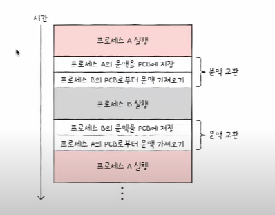

### 1. 컨텍스트 스위칭 시에는 어떤 일들이 일어나나요?

컨텍스트 스위칭이 발생하면 운영 체제는 현재 실행 중인 프로세스의 상태(레지스터 값, 프로그램 카운터 등)를 저장합니다. 
그리고 다음 실행될 프로세스의 문맥을 보며 복구하고, 해당 작업을 다시 수행합니다.

### 2. 프로세스와 스레드는 컨텍스트 스위칭이 발생했을 때 어떤 차이가 있을까요?
❓  
스레드가 빠르다.

1. TCB가 PCB보다 가볍다. 프로세스 내 스레드는 공유하는 영역이 많아 TCB에는 stack 및 간단한 레지스터 포인터만 저장하기 때문에 읽고 쓸때 빠르다.
2. 캐시 메모리를 초기화 하지 않아도 된다. 프로세스 내 스레드 간에 스택과 레지스터 값 등 일부 컨텍스트 정보만 변경되므로

### 3. 컨텍스트 스위칭이 발생할 때, 기존의 프로세스 정보는 커널스택에 어떠한 형식으로 저장되나요?
❓  

### 4. 컨텍스트 스위칭은 언제 일어날까요?

준비상태에서 실행상태가 될 때,  
실행상태에서 타이머 인터럽트를 받아 준비상태가 될 때,  
실행상태에서 입출력과 같은 이벤트로 대기상태가 될 때 일어납니다.

---

### 0. 문맥 교환이란 무엇인가요?

먼저, 한 프로세스에서 다음 프로세스로 실행 순서가 넘어갈 때, 기존에 실행되던 프로세는 지금까지의 수행했던 중간 정보를 백업해놔야합니다.
이러한 중간 정보들을 문맥이라고 표현합니다. 그리고 다음 프로세스에서 백업되있던 문맥들을 보며 복구하고 
다시 기존작업을 수행하는 이 과정을 문맥교환이라고 합니다.

