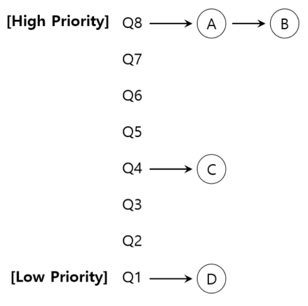

### 프로세스 스케줄링 알고리즘에는 어떤 것들이 있나요?
- 참조
  - https://qkrtngus116.tistory.com/50

### RR을 사용할때, Time Slice에 따른 trade-off는 무엇인가?
- Round Robin
  - 시분할 시스템을 위해 설계된 선점형 스케줄링의 하나로, 프로세스들 사이에 우선순위를 두지 않고 시간단위로 cpu를 할당하는 방식

  - Time Slice에 따른 trade-off는 아래와 같다.
    - time slice가 너무 짧으면, context-switching에 대한 overhead가 크다.
    - time slice가 너무 길면, 대기하는 프로세스들이 지연될 수 있다. 또, FCFS와 같아지게 된다.

### 싱글 스레드 CPU에서 상시로 돌아가야하는 프로세스가 있다면, 어떤 스케줄링 알고리즘을 사용하는 것이 좋을까요?
- 상시로 돌아가야하는 프로세스가 cpu를 점유하지 못하였다면, 선점형 스케줄링을 이용한다.
- 만약 상시로 돌아가야하는 프로세스가 cpu를 점유한 상황이라면, 비선점, aging을 적용한 우선순위 스케줄링으로 생각한다.
  - aging을 적용해야하는 이유는, 상시로 돌아가야하는 프로세스에 이슈가 발생하였다면, 다른 프로세스에게 cpu를 넘겨줘야하기 때문이다.

### 동시성과 병렬성의 차이에 대해 설명해주세요.
- 동시성은 cpu core가 1개일때, 시분할 시스템으로 process를 짧은 시간동안 번갈아가면서 실행되는 것을 의미하며
- 병렬성은 cpu core가 여러개 일때, 각각의 core가 각각의 프로세스를 실행하는 것을 의미한다.

### 타 스케줄러와 비교하여, multi-level-feedback-queue는 어떤 문제점을 해결한다고 볼 수 있을까요?

- multi-level-feedback-queue
  - 작업이 진행되는 동안 해당 작업의 정보를 얻고, 이 정보를 이용하여 미래 행동을 예측한다.
  - 규칙1) Priority(A) > Priority(B)이면, A가 실행된다.
  - 규칙2) Priority(A) = Priority(B)이면, A와 B는 RR방식으로 실행된다.
  - 규칙3) 작업이 시스템에 진입하면, 가장 높은 우선순위, 즉 맨 위 큐에 놓여진다.
    - 이때, 스케줄러는, 작업이 짧은 작업인지, 긴 작업인지 알 수 없기때문에 일단 짧은 작업이라고 가정하여 높은 우선순위를 부여한다.
    - 진짜 짧은 작업이라면, 주어진 time slice내에 작업이 끝날 것이고, 짧은 작업이 아니라면, 천천히 아래 큐로 이동하게 된다.
  - 규칙4) 4a와 4b를 재정의하여, cpu 총 사용시간을 측정하여, 주어진 시간 할당량을 소진하면, 우선순위는 낮아진다.
    - 4a) 주어진 time slice를 모두 사용하면 우선순위는 낮아진다. 즉, 한 단계 아래 큐로 이동한다.
    - 4b) time slice를 모두 소진하기 전에 cpu를 양도하면 같은 우선순위를 유지한다.
      - **4a와 4b를 재정의하는 이유는, 주어진 time slice가 끝나기 직전에 입출력명령어를 내릴 수 있어, 자신에게 유리하도록 조작하게 된다.**
      - **따라서, cpu 총 사용시간을 측정하도록 변경한 것!**
  - 규칙5) 일정시간 S가 지나면, 시스템의 모든 작업은 최상위큐로 이동시킨다.

- 장점
  - **규칙5에 의해 starvation 현상이 발생하지 않는다.**
  - **규칙5에 의해 cpu위주의 작업이 대화형 작업으로 특성이 변할 경우, 우선순위 상향을 통해 스케줄러가 변경된 특성에 적합한 스케줄링 방법을 적용한다.**

- 참조블로그
  - https://lipcoder.tistory.com/62

### FIFO 스케쥴러는 정말 쓸모가 없는 친구일까요? 어떤 시나리오에 사용하면 좋을까요?
- 우선순위가 같은 여러 프로세스를 처리해야할 때는 FIFO순서로 처리한다.

- 참조블로그
  - https://cow-kite24.tistory.com/120

### 우리는 스케줄링 알고리즘을 "프로세스" 스케줄링 알고리즘이라고 부릅니다. 스레드는 다른 방식으로 스케줄링을 하나요?
- 프로세스가 A,B,C순서로 생성되었고 각각의 스레드가 a1, b1, a2, b2, c1, c2로 생성되었다고 가정하자.
- 만약 "프로세스" 스케줄링이라면, 스케줄링이 A -> B -> C의 순서로 이루어진다.
- "스레드 스케줄링"이라면, a1 -> b1 -> a2 -> b2 -> c1 -> c2로 이루어진다.
- 특정 "작업"을 정해서 스케줄링을 하게 되는데, 가령 프로세스는 우선순위대로 실행되고, 스레드는 각각 공평하게 실행되길 기대할때, 프로세스는 MLFQ를 사용하고, 스레드는 RR를 사용할 수 있다.
- 즉, 위에 대한 답변은 같은 방식으로 스케줄링할 수도 있고 다른 방식으로 스케줄링할 수도 있다.

### 유저 스레드와 커널 스레드의 스케쥴링 알고리즘은 똑같을까요?
- user thread
  - 커널이 생성해주는게 아니라 응용 프로그램 내의 라이브러리에 의해서 구현 및 관리되는 스레드
  - 커널 위에서 지원되기떄문에 커널은 user thread를 인식하지 못한다.
  - 장점
    - 커널의 개입없이 스레드 생성, 스레드 교체, 스레드 동기화 등을 할 수 있기때문에 관리가 빠르다.
  - 단점
    - 한 스레드가 i/o요청을 하면 대기 상태가 되어 blocked된다면, 다른 스레드도 함께 blocked된다.
      - 즉, 실행중인 스레드A가 i/o요청으로 blocked된다면, 현재 프로세스의 다른 스레드로 cpu가 넘어가는 것이 아니라, 아예 다른 프로세스로 스케줄링된다.

- kernel thread
  - 운영체제에 의해 직접 지원되고 관리되는 스레드
  - 스레드의 생성 및 스케줄링 등의 관리가 커널에서 이루어진다.
  - 장점
    - 한 스레드가 대기상태로 들어가 blocked되어도 다른 스레드는 실행을 계속할 수 있다.
    - 따라서, blocked가 빈번한 애플리케이션에서 사용하면 좋다.
  - 단점
    - 커널에서 모든 프로세스뿐만 아니라, 스레드까지 생성 및 관리하기때문에 커널의 복잡도가 높아지고 오버헤드가 발생한다.

- thread 스케줄링
  - **PCS**(Process-Contention scope, **프로세스 기준 스케줄링**)
    - 같은 프로세스 내의 스레드들끼리 cpu를 경쟁하는 형태
    - 프로세스를 먼저 스케줄링한 후, 선택된 프로세스 내의 스레드를 스케줄링하는 것
  - **SCS**(System-Contention scope, **스레드 기준 스케줄링**)
    - 어느 커널 thread가 cpu를 점유할지 결정하는 형태
    - 전체 스레드를 대상으로 어떻게 스케줄링 할 것인가
  
  - PCS랑 SCS는 상호배타적이라 양립이 불가능하다.
  - 만약 SCS를 사용한다면, 프로세스를 스케줄링할 필요가 없다.

- 참조블로그
  - https://qkrtngus116.tistory.com/45
  - https://yjksw.github.io/os-user-kernel-thread/