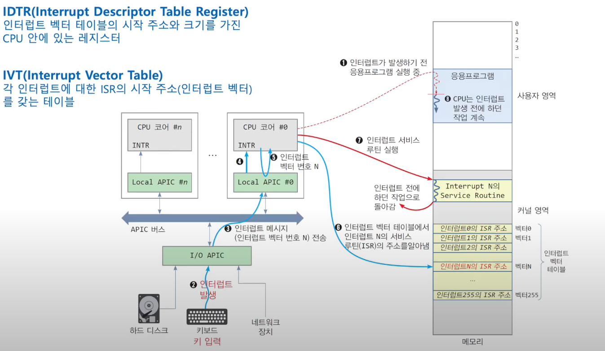

## 1. 인터럽트가 무엇인지 설명해주세요.
- CPU가 특정 기능을 수행하는 도중에 급하게 다른 일을 처리하고자 할 때 사용할 수 있는 기능으로, 
**CPU가 다음 기계어를 실행하기 전에 CPU제어권을 자동으로 운영체제에게 넘어가게 하는 것**을 인터럽트라고 한다.

## 2. 인터럽트는 어떻게 처리하나요?

1) 실행중인 프로그램을 중단
2) 현재 프로그램상태(PCB)를 커널영역에 보관 (컨텍스트 스위칭 = 문맥교환)
3) 인터럽트 처리 루틴을 실행
4) 인터럽트 서비스 루틴을 실행
5) 인터럽트 요청신호가 발생했을때 보관한 PC의 값을 복원하여 이전 실행위치로 복귀
6) 이어서 프로그램을 실행

## 3. Polling방식에 대해 설명해주세요.
- polling과 interrupt 모두 CPU와 입출력장치의 통신방식

| polling | interrupt |
| --- | --- |
| 다른 프로세스에게 CPU를 양도하지 않고, 하드웨어 장치가 동작을 완료할때까지 계속 루프를 돌면서 하드웨어 상태를 체크하는 방식을 말한다. | CPU가 프로그램을 실행하는 도중에 I/O나 다른 예외 상황발생으로 특별한 처리가 필요할때 CPU에 이를 알려 처리하도록 하는 것을 말한다. 운영체제는 I/O를 요청한 프로세스를 블록시키고 CPU를 다른 프로세스에게 양도한다. |
- 인터럽트를 사용하면, CPU연산과 I/O장치 작업을 중첩시켜서 수행할 수 있게 되어 인터럽트를 통해 I/O처리를 하는 것이, polling보다 CPU의 사용률을 높이는 방법이다.
- 하지만 인터럽트가 폴링보다 무조건 좋은것은 아니다!
    - 예를 들어, 어떠한 작업이 단 한번의 polling만으로 끝날 정도의 빠른 하드웨어장치라면 interrupt보다는 polling이 더 효과적이라고 할 수 있다.
    - interrupt는 현재 실행중인 프로세스를 다른 프로세스로 context-switching하게 되고 많은 비용이 수반되기 때문에, 빠른 하드웨어 장치라면 polling이 더 효율적이고 느린 하드웨어 장치라면 interrupt가 더 효율적이라고 할 수 있다.

## 4. HW / SW인터럽트에 대해 설명해주세요.
HW 인터럽트 : 타이머, 디스크컨트롤러 등 하드웨어가 걸어주는 인터럽트를 의미한다.

---

타이머 : 예를 들어 프로그램a가 무한루프를 도는 프로그램이라면, 프로그램으로부터 cpu를 빼앗아야된다. 이처럼 cpu독점을 막기위해 부가적인 하드웨어를 두고있는데 이를 timer라고 하며, timer는 일정시간이 지나면 인터럽트를 발생시킨다. 이렇게 되면 cpu의 제어권이 운영체제에게 넘어가게 된다.

---

SW 인터럽트(=Trap) : 시스템콜, Exception등을 말함.

시스템 콜 : 개별 프로그램이 운영체제에게 CPU제어권을 넘겨주기 위해 개별 프로그램 스스로 인터럽트를 거는 경우를 의미한다. 인터럽트를 걸게되면, mode bit을 0으로 바꾸면서 운영체제에게 cpu를 넘기게 된다.

Exception : 프로그램에서 예외사항이 발생해서 프로그램에게 더이상 cpu를 주지 않고 운영체제에게 넘겨주고싶을때, 프로그램이 본인에게 없는 권한을 실행하려고한다면, mode bit을 0으로 바꾸면서 cpu를 운영체제에게 넘어가는 것을 의미한다.

## 5. 동시에 두 개 이상의 인터럽트가 발생하면, 어떻게 처리해야 하나요?
- 동시에 두 개 이상의 인터럽트가 발생하면, 운영 체제 또는 프로그램이 이러한 인터럽트를 적절하게 처리해야 한다. 
다음은 일반적으로 사용되는 처리 방법이다.

- 인터럽트 우선순위 지정: 인터럽트에는 각각 우선순위가 할당한다. 높은 우선순위를 가진 인터럽트가 먼저 처리되고, 낮은 우선순위를 가진 인터럽트는 대기하게 된다.

- 인터럽트 비활성화(다중환경에서는 비적합): 모든 인터럽트를 일시적으로 비활성화하여 다른 인터럽트가 발생하지 못하게 할 수 있다. 이후에는 다시 인터럽트를 활성화하여 처리할 수 있다. 하지만 이 방법은 다중 작업 환경에서는 적합하지 않을 수 있다.

- 인터럽트 큐: 각 인터럽트를 큐(Queue)에 넣어서 순서대로 처리하도록 할 수 있다. 이 방법은 우선순위와 함께 사용될 수 있다.

- 인터럽트 처리 루틴 개선: 인터럽트 서비스 루틴을 최적화하여 실행 시간을 단축하고, 동시에 여러 인터럽트를 효과적으로 처리할 수 있도록 설계할 수 있다.

- 임계 영역 사용: 인터럽트 처리 중에는 임계 영역을 설정하여 공유 자원에 대한 접근을 제한할 수 있다. 이는 동기화를 통해 여러 인터럽트 간의 충돌을 방지할 수 있다. (?)