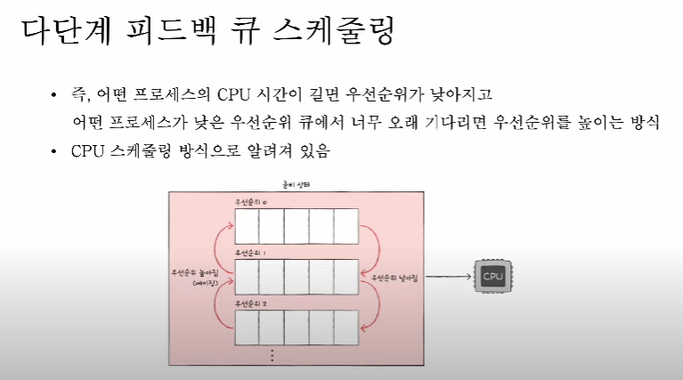

### 1. 프로세스 스케줄링 알고리즘에는 어떤 것들이 있나요?

📌 스케줄링 알고리즘은 CPU 스케줄러(단기 스케줄러)가 준비 큐에 있는 프로세스 중 어떤 프로세스를 실행시킬지 결정하는데 사용한다.

비선점형 선점형으로 나눠서 말씀드리자면, 
- 먼저 비선점형으로는
- - FCFS(First Come First Served) : 준비큐에 먼저 들어온대로 우선순위를 갖는 방식입니다.
- - SJF(Shortest Job Next) : 준비큐 안에서 실행시간이 짧은 것이 우선순위를 갖는 방식입니다.

- 선점형으로는
- - RR(Round Robin) : 타임 퀀텀을 정해 일정 시간동안 번갈아가며 수행하는 방식입니다.
- - SRT(Shortest remaining time) : 준비 큐에서 대기 시간이 가장 짧게 남은 프로세스가 우선순위를 갖는 방식입니다.
- - 멀티 레벨 큐 스케줄링 : 우선순위별로 준비 큐를 여러개 사용하는 방식입니다. 큐를 여러개 놓음으로서 큐 별로 스케줄링을 달리하여 처리가 가능한 방식입니다.  
(-> 이에 더 발전된 형태임 멀티레벨 피드백 큐 스케줄링)  
등이 있습니다.

### 2. RR을 사용할 때, Time Slice에 따른 trade-off를 설명해 주세요.

time slice가 길다면 선입선처리 알고리즘과 다를것이 없게 되며, 
반대로 time slice 짧다면 그만큼 문맥교환이 이뤄지는 과정에서 오버헤드가 발생할 수 있습니다.  

### 3. 싱글 스레드 CPU 에서 상시로 돌아가야 하는 프로세스가 있다면, 어떤 스케쥴링 알고리즘을 사용하는 것이 좋을까요? 또 왜 그럴까요?

멀티레벨 피드백 큐를 사용하면 우선순위가 높은 것부터 실행하기 때문에 좋습니다. 
해당 알고리즘은 큐를 이동해가며 오래 사용했다면 우선순위를 낮추고 에이징 기법으로 우선순위를 다시 높여가며 기아상태도 막을 수 있기 때문입니다.

### 4. 동시성과 병렬성의 차이에 대해 설명해 주세요.
❓
- 동시성
- - 동시성이란 CPU가 쉬는 쉬간을 최대한 낮추는 것
- - task를 번갈아 가면서 실행

- 병렬성
- - 실제로 동시에 여러작업이 처리
- - 멀티 코어에서 멀티 스레드 동작

### 5. 타 스케쥴러와 비교하여, Multi-level Feedback Queue는 어떤 문제점들을 해결한다고 볼 수 있을까요?

기아 상태 문제를 해결할 수 있습니다.  
가장 먼저 들어온 프로세스부터 처리를 하는데, 이때 time-slice 기법도 적용하여 일정 시간동안 처리를 완료하지 못하면
한단계 우선순위가 낮은 큐에 이동합니다. 이렇게 반복적으로 큐 간에 진행되다가, 에이징 기법을 적용했기 때문에 
오래 방치되어도 점차 우선순위가 높은 큐에 진입하게 되기 때문에 기아상태를 해결할 수 있습니다.

### 6. FIFO 스케쥴러는 정말 쓸모가 없는 친구일까요? 어떤 시나리오에 사용하면 좋을까요?
❓  
프로세스가 준비 큐에 들어온 시간이 늦는 시나리오 일 때 사용하면 좋을 것 같습니다.  
프로세서가 지속적으로 유용한 프로세스를 수행하여 처리율이 높습니다.  

### 7. 우리는 스케줄링 알고리즘을 "프로세스" 스케줄링 알고리즘이라고 부릅니다. 스레드는 다른 방식으로 스케줄링을 하나요?
❓  
아닙니다. 할당 대상만 다를 뿐 방식은 프로세스 스케줄링과 동일합니다. 

### 8. 유저 스레드와 커널 스레드의 스케쥴링 알고리즘은 똑같을까요?
❓  
다릅니다. 
커널 스레드는 프로세스 스케줄링과 동일하게 작동하지만,   
유저 스레드에서는 애초에 스케줄링 우선순위를 지정하지 않습니다. 너무 변칙이기도 하며, 무슨 스레드가 먼저 동작할 지 모른다.

[참고] https://www.crocus.co.kr/1255

---

### 우선순위 각 스케줄링별 단점

- FCFS : 호위효과 발생 (뒤에 있는 프로세스가 기다리는 시간이 매우 길어짐)
- SJF : 기아 상태 발생 
- RR : 타임 퀀텀에 따라 
- SRT : 기아 상태 발생
- 다단계큐 (멀티 레벨) : 큐 별로 우선순위별로 처리가 되는데, 큐 간에 이동이 불가 -> 기아 상태 발생

### 어떻게 기아상태 방지를 할 수 있을까요?

- 에이징 기법을 사용할 수 있습니다. 오랫동안 대기한 프로세스를 마치 나이를 먹듯이 우선순위를 점차적으로 높여 기아상태를 방지할 수 있습니다.