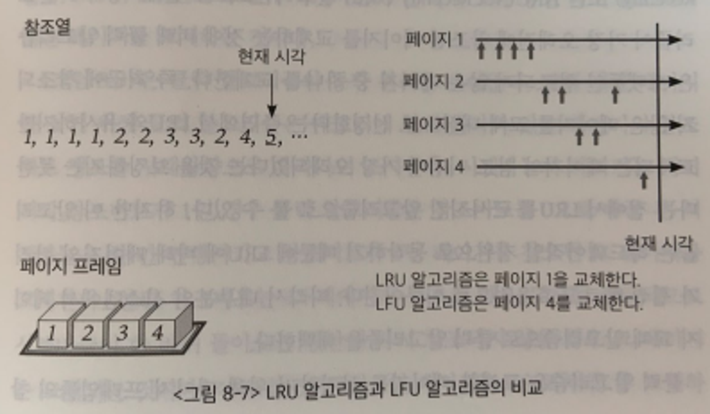

## 1. 페이지 교체 알고리즘에 대해 설명해주세요.
- 어떤 페이지를 내쫓아야하는가를 결정하는 알고리즘을 의미한다.

## 2. LRU 알고리즘은 어떤 특성을 이용한 알고리즘이라고 할 수 있을까요?
- LRU 알고리즘은 가장 오랫동안 사용되지 않은 페이지를 교체하는 알고리즘이다.

## 3. LRU 알고리즘을 구현한다면, 어떻게 구현할 수 있을까요?
- LRU알고리즘은 연결리스트를 사용해서 O(n)시간에 구현할 수 있다.
- LRU는 메모리 내의 페이지들을 참조시간 순서대로 연결리스트로 나열해서 관리한다.
- 연결리스트이 앞쪽일수록, 오래전에 참조된 페이지이고, 뒤쪽으로 갈수록 최근에 참조된 페이지이다.
- LRU알고리즘은 가장 오래전에 참조된 페이지를 내쫓는 알고리즘으로, 연결리스트이 가장 앞쪽에 있는 원소에 해당하는 페이지를 쫓아내면 된다.
- 만약 어떤 페이지가 새롭게 미모리에 적재되거나, 원래 적재되어있던 페이지가 다시 참조되면, 해당 페이지를 연결리스트이 가장 뒤쪽으로 이동시킨다.

## 4. LRU 알고리즘의 단점을 설명해 주세요. 이를 해결할 수 있는 대안에 대해서도 설명해 주세요.

- 단점으로는 프로세스가 주기억장치에 접근할때마다 참조된 페이지 시간을 기록해야하므로, 막대한 오버헤드가 발생한다.
- 또, 위 그림에서 볼수 있다시피, 1번페이지가 참조횟수가 높음에도 불구하고, 가장 오래전에 참조되었다는 이유로 내쫓는 문제가 발생한다.

