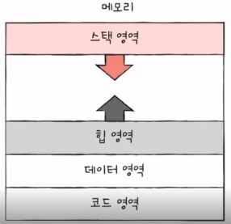
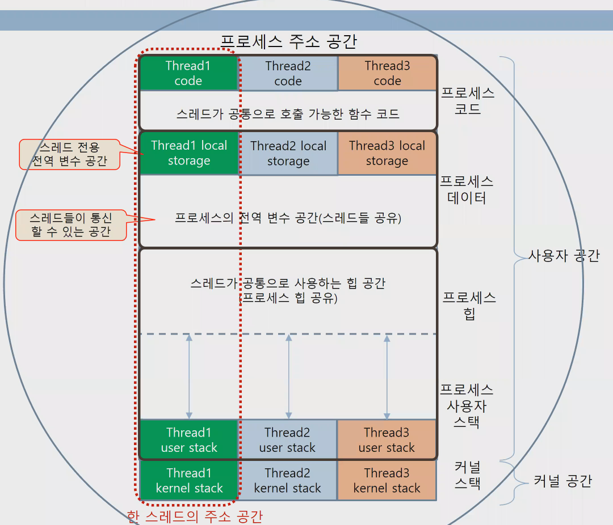
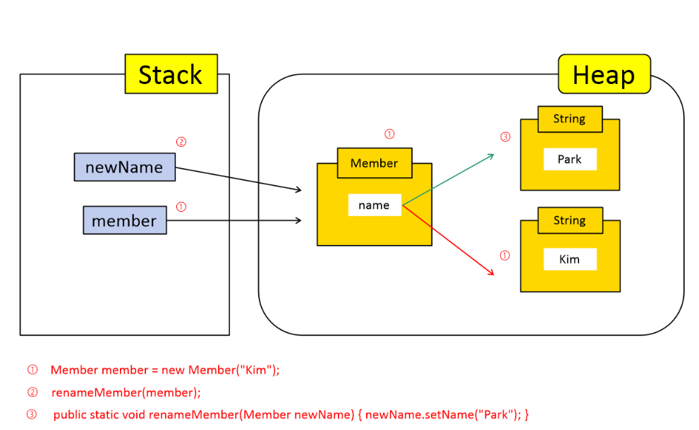
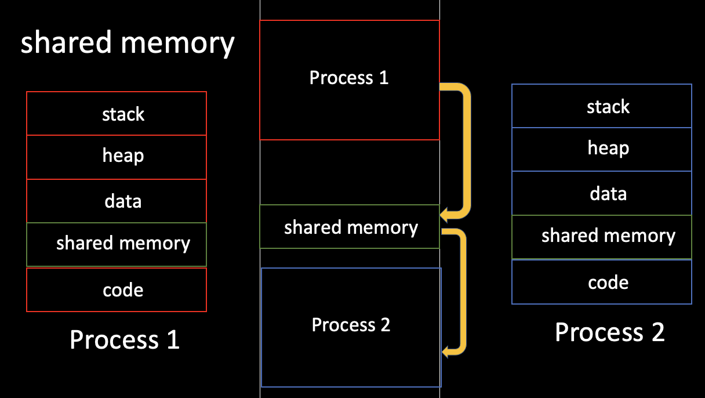

## 1. 프로세스 주소공간 + 2. 초기화되지 않은 변수가 저장되는 공간

프로세스 주소공간은 code, data, stack, heap영역으로 나뉜다.

code와 data영역은 정적할당영역, stack과 heap영역은 동적할당영역

- code영역
    - 실행할 프로그램의 코드가 저장되는 영역으로 바꿀 수 없는 Read-Only로 지정되어있다.
    - **컴파일시에 결정된다.** (java로 대입하면, .java파일이 .class로 되는 것)
- data영역
    - **전역변수와 static변수**가 저장되는 공간
    - **컴파일시에 결정된다.**
    - 프로그램의 시작과 함께 할당되며, 프로그램이 종료되면 소멸된다.
    - 초기화된 데이터는 data영역에 저장되고, 초기화되지 않은 데이터는 BSS(Block Stated Symbol)영역에 저장된다.
        - 초기화되지 않은 변수는 프로그램이 실행될때 공간만 할당이 된다.
        - 초기화된 변수는 초기화 된 ‘값’도 프로그램에 저장하고 있어야하기 때문에 data영역에 할당된다.
        - **bss영역에 할당되는 변수들(즉, 초기화되지 않은 변수들)이 많아져도 data영역 변수들에 비해 실행코드 사이즈가 늘어나지 않는다.**
            - **이유는, data영역 변수는 ‘변수를 초기화하는 코드’를 필요로 하지만, bss영역은 초기화하는 코드는 필요하지 않기때문이다!**
            - **static int a;로 선언하면 자동으로 0으로 초기화되는데, 이때 a는 bss영역에 할당이 된다. 직접적으로 0이 아닌 다른 값으로 초기화하게 되면, data영역에 할당된다.**
    - 실행도중에 변경될 수도 있기때문에 read-write로 지정되어있다.
- stack영역
    - **지역변수와 매개변수**가 저장되는 공간
    - 높은 주소 → 낮은 주소로 할당된다.
    - **컴파일 시 크기가 결정된다.**
- heap영역
    - **런타임(JVM에 의해 .class파일이 실행되는 것)에 크기가 결정되는 메모리 영역**으로 사용자에 의해 메모리 공간이 동적으로 할당되고 해제된다.
    - 프로그래머가 직접 할당할 수 있는 저장공간
    - 낮은 주소 → 높은 주소로 할당된다.



## 3. 일반적인 주소공간 그림처럼, Stack과 Heap의 크기는 매우 크다고 할 수 있는가? 그렇지 않다면, 그 크기는 언제 결정되는가?

- stack과 heap은 메모리 영역을 공유하고 있다.
- stack은 컴파일 시에 크기가 결정되며 heap은 런타임시에 크기가 결정된다.
- stack은 높은 주소에서 낮은주소로 할당되고, heap은 낮은주소에서 높은 주소로 할당된다.

### Heap overflow

: 낮은주소부터 채워나가다 스택영역을 침범하는 경우

### Stack overflow

: 높은주소부터 채워나가다 heap영역을 침범하는 경우

- 1번 문항 ~ 3번문항 참조블로그
    - https://dev-dmsgk.tistory.com/29
    - [https://velog.io/@hidaehyunlee/메모리-구조를-알아보자](https://velog.io/@hidaehyunlee/%EB%A9%94%EB%AA%A8%EB%A6%AC-%EA%B5%AC%EC%A1%B0%EB%A5%BC-%EC%95%8C%EC%95%84%EB%B3%B4%EC%9E%90)

## 4. Stack과 Heap공간에 대해 할당 속도가 더 빠른 공간은 어디일까요?

- stack영역에서의 할당은 이미 생성된 공간에 대해 포인터의 위치만 바꿔주는 단순한 cpu연산이기때문에 할당속도가 빠르다.
- heap영역에서의 할당은 요청되는 양과 현재 메모리 상황 등 다양한 요소를 고려해야하기 때문에 더 많은 cpu연산이 필요하여 stack보다 할당속도가 느리다.
- 참조블로그
    - https://beenii.tistory.com/111

## 5. 위처럼, 공간을 분할하는 이유는?

- **최대한 데이터를 공유하여 메모리 사용량을 줄이기 위해서이다!**
- 예를 들어, code영역은 같은 프로그램 자체에서는 모두 같은 내용이기때문에 따로 관리하여 공유하게 된다.

## 6. 스레드의 주소공간?

하나의 스레드가 실행되기 위해 주어지는 주소공간은 총 6개의 영역으로 나누어지낟.

- Thread Code
    - 스레드의 코드가 저장된 공간
- TLS(Thread Local Storage)
    - 다른 스레드와 공유하지 않는 해당 스레드만이 사용하는 영역
- Thread Stack
    - 스레드에 사용되는 지역변수, 매개변수가 저장되는 공간
- 프로세스의 전역 변수 공간
    - 프로세스 내부에 존재하는 모든 스레드가 접근 가능한 전역변수가 담긴 공간
- 프로세스의 힙 메모리 공간
    - 모든 스레드가 사용가능한 프로세스의 힙 메모리 영역
- 커널 스택
    - 해당 스레드가 커널 모드에서 실행될때 사용되는 커널 공간



- 참조블로그
  - https://palamore.tistory.com/333

## 7. Stack영역과 Heap영역은 자료구조의 Stack/Heap과 연관이 있을까요? 그렇다면, 각 주소공간의 동작과정과 연계해서 설명하시오.

### stack영역

- 스레드 당 하나씩 할당이 된다.
- 스레드가 새롭게 생성되면, 해당 스레드에 해당하는 stack영역도 새롭게 생성이 된다.
- 특정 스레드가 다른 스레드의 stack영역에는 접근할 수 없다.
- **객체 생성 시, 객체를 참조하는 변수가 저장이 된다.**
  - **예를 들어, Member member = new Member(); 로 객체를 생성하면**
  - **객체를 참조하는 변수 member는 stack에 저장이 된다.**
  - **변수 member가 참조하는 객체는 heap에 저장이 된다.**
- **stack의 데이터는 LIFO형태로 관리된다.**
- **scope범위를 벗어나면, stack메모리에서 사라진다.**

### heap영역

- 모든 스레드가 공유하는 영역으로, 스레드의 개수에 상관없이 단 하나의 heap영역만 존재한다.
- object타입의 데이터(String, Integer 등) 및 동적으로 생성한 객체(new연산자)가 저장된다.
- stack처럼 LIFO형식으로 관리되지 않고 **랜덤하게 할당된다.**
- **가비지컬렉터를 이용해 메모리를 관리한다.**

```java
public class Main {
	public static void main(String[] args) {
	Member member = new Member("Kim"); // 1
	renameMember(member); // 2
	System.out.println(member.getName());
	}

	public static void renameMember(Member newName) { // 3
	    newName.setName("Park");
	}
}
```



1. heap영역에서 Member객체와 Object타입의 string객체가 생성되었다. stack영역에는 Member객체를 참조하는 member가 생성되었다.
2. renameMember()를 호출하는데, newName이라는 매개변수를 가지고 있고 Member객체를 참조한다.
  1. 따라서 newName이 stack에 저장된다.
  2. setName메소드로 이름이 변경되는데, 이때 새로운 string객체를 생성하게 된다.
  3. Kim객체값은 더이상 사용되지 않으므로, 이후 **가비지 컬렉터에 의해 제거된다.**
3. System.out.println(member.getName());로 이동했다.
  1. 즉, renameMember()의 newName변수의 역할은 끝이 났다 = **scope를 벗어났다.**
  2. **따라서 LIFO형식으로 관리되는 stack의 특성에 따라 newName변수가 제거된다.**
  3. Member객체의 name필드값을 출력하는데 이때, park라는 값을 가지고 있기때문에 park라는 값을 출력한다.

- 참조블로그
  - https://charliecharlie.tistory.com/365

## 8. IPC의 Shared Memory 기법은 프로세스 주소공간의 어디에 들어가나요? 그런 이유가 있을까요?

- 공유 메모리 방식에서는 프로세스들이 주소 공간의 일부를 공유하는데, 이 공유한 메모리 영역에 read/write를 통해 통신을 수행한다.
- 프로세스가 공유 메모리 할당을 커널에 요청하면, 커널은 해당 프로세스에 메모리 공간을 할당해준다.
- 공유 메모리 영역이 구축된 이후에는 모든 접근이 일반적인 메모리 접근으로 취급되기 때문에 더 이상 커널의 도움없이도 각 프로세스들이 해당 메모리 영역에 접근할 수 있다.
- 공유 메모리 방식은 프로세스 간의 통신을 수월하게 만들지만, 동시에 같은 메모리 위치에 접근하게 되면, 일관성 문제가 발생할 수 있다.
- 커널은 이 부분에 대해 전혀 관여하지 않기때문에 프로세스끼리 직접 공유 메모리 접근에 대한 동기화 문제를 책임져야한다.



- 참조블로그
  - https://hyuuny.tistory.com/153


## 9. Stack과 Heap의 크기는 언제 결정되나요? 프로그램 개발자가 아닌, 사용자가 공간의 크기를 수정할 수 있나요?

- stack은 컴파일시에, heap은 런타임시에 크기를 결정한다.
- 사용자가 공간의 크기를 수정할 수 없으며, 개발자(=프로그래머)가 내부 메모리 관리에 책임진다.