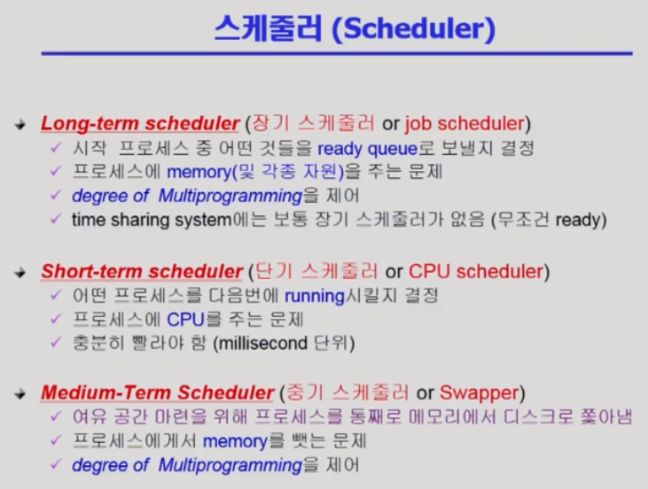
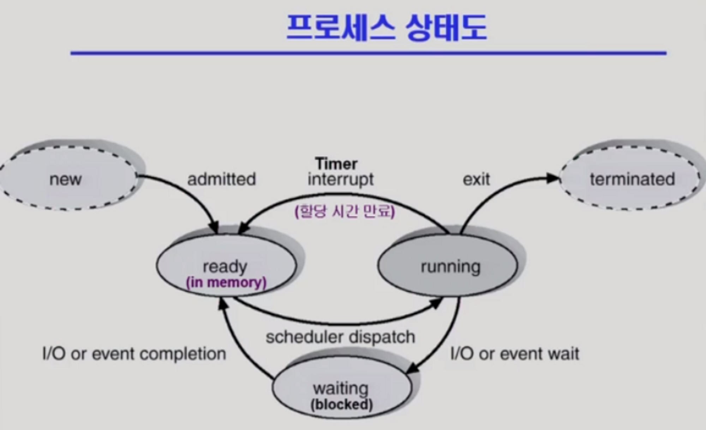
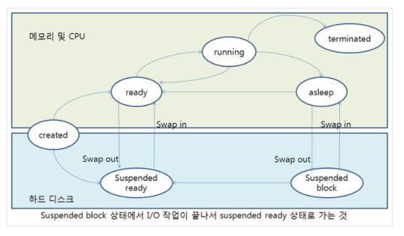

### 1. 단기, 중기, 장기 스케줄러란 무엇인가?

- 단기 스케줄러는 어떤 프로세스에 cpu를 얼마나 줄지(어떤 프로세스를 running시킬 것인가),
- **중기 스케줄러는 어떤 프로세스를 메모리에서 디스크로 쫓아낼 것인가,**
- 장기 스케줄러는 어떤 프로세스를 메모리에 줄 것인가(어떤 프로세스를 ready queue로 보낼 것인가) 하는 문제를 의미한다.

- **중기스케줄러와 장기 스케줄러 모두 degree of multiprogramming을 제어**하는데, 
- 이때, **degree of multiprogramming은 프로세스를 메모리에 얼만큼 올릴 것인가**를 의미한다.

- 과거에는, 프로세스가 생성이 되고 장기 스케줄러에 의해 admitted이 되어야 ready상태가 될 수 있다.
- 이 장기 스케줄러로 degree of multiprogramming을 제어하였다.

- **현재에는 degree of multiprogramming을 제어하기 위해 중기스케줄러를 두며, 중기스케줄러를 swapper**라고도 한다.
  - **따라서, 장기 스케줄러는 사용하지 않음!**

### 2. 프로세스의 스케줄링 상태란?

- 프로세스가 새롭게 생성된 상태인 created에서 dispatcher에 의해 어떤 프로세스를 running시킬지 결정된다.
- running상태 
  - secondary storage에 저장되어있는 실행파일이 메모리에 load되는 과정
  - 즉, cpu를 할당받기를 기다리고 있는 상태
- blocked(=wait)
  - running상태에서 I/O작업이 발생하면 wait(=blocked)상태에 빠지게 된다.
  - **I/O가 끝나면 다시 ready상태로 들어가게 된다.** **(바로 running상태로 가는 것이 아님!)**
- suspended ready
  - ready상태에서 계속 cpu를 점유하지 못하던 프로세스가 중기 스케줄러에 의해 디스크로 swap out된다.
- suspended block
  - block상태에 있던 프로세스가 ready상태로 못넘어가게 된다면, 중기 스케줄러에 의해 디스크로 swap out된다.
  - suspend block상태에서 I/O가 끝나면 다시 suspended ready상태로 가게 된다.
- terminated
  - 프로세스가 종료되면, terminated상태로 가게 된다.

- 참조블로그
  - https://operatingsystems.tistory.com/entry/OS-%ED%94%84%EB%A1%9C%EC%84%B8%EC%8A%A4-%EA%B4%80%EB%A6%ACProcess-Management
  - https://growth-coder.tistory.com/184

### 3. preemptive/non-preemptive에서 존재할 수 없는 상태가 있을까요?

- preemptive 스케줄링은 어떤 프로세스가 cpu를 할당받아 실행중인 상태에서, 다른 프로세스가 실행중인 프로세스를 중지하고 cpu를 강제로 점유하는 방식

- non-preemptive 스케줄링은 어떤 프로세스가 cpu를 할당받으면 그 프로세스가 종료되거나 입출력요구에 의해 프로세스가 자발적으로 중지될때까지 계속 실행하도록 보장하는 것

1) running -> wait (by I/O)
2) running -> ready (by time interrupt)
3) waiting -> ready (by I/O)
4) terminate (by exit() systemcall)
5) ready -> running (by dispatcher)

- non-preemptive는 1번과 4번에 대해 발생하게 된다.
- preemptive는 2번과 3번에 대해 발생하게 된다.
- **preemptive는 효율이 극대화되어 오버헤드가 발생하는 반면, nonpreemptive는 효율이 떨어지는 반면 오버헤드가 발생하지 않는다.**

- non-preemptive
  - FCFS(First Come First Service)
    - Ready queue에 도착한 순서대로 차례로 cpu를 할당하는 기법
  - SJF(Shortest Job First)
    - Ready queue에 기다리고 있는 프로세스 들 중에서 실행시간이 가장 짧은 프로세스에게 먼저 cpu를 할당
  - HRN(Hightest Response-ratio Next)
    - 실행시간이 긴 프로세스에 불리한 SJF기법을 보완하기 위한 것으로, 대기시간과 서비스시간을 이용하는 기법을 의미한다.
    - 우선순위 계산 공식을 이용하여 서비스 시간이 짧은 프로세스나 대기 시간이 긴 프로세스에게 우선순위를 주어 cpu를 할당하는 기법

- preemptive
  - Round Robin 스케줄링
    - cpu할당 시간이 만료되면 ready queue의 맨 디ㅜ로 들어가 다시 순서를 기다린다.
  - SRT(Short Remaining Time) 스케줄링
    - ready queue에 실행 중인 프로세스보다 짧은 작업이 존재한다고 판단되면, 그 작업을 먼저 실행한다.
  - mulit level queue  
    - 프로세스들을 중요도에 따라 여러 종류의 그룹으로 나누어 여러개의 큐에 다양한 알고리즘을 적용한 스케줄링
    - 우선순위가 높은 것은 foreground, 우선순위가 낮은 것은 background
    - foreground는 RR, background는 FCFS
    - 문제점) 
      - 고정적 우선순위 스케줄링으로 starvation의 가능성이 있음.
      - 우선순위가 낮은 것은 아예 cpu할당을 못가지는 문제 발생 
  - multi level feedback queue
    - 여러 개의 queue로 구성되어있고 각각 queue마다 다른 우선순위가 배정된다.
    - queue에는 프로세스가 배정되고 한 queue에 여러 개의 프로세스가 배정 될 수 있다.
    - 우선순위가 높은 queue에 있는 작업이 먼저 실행된다. 
    - 같은 queue에 있는 여러 작업은 RR스케줄링을 적용하여 실행한다.
      - 작업마다 고정된 우선순위를 부여하는 것이 아니라 각 작업의 특성에 따라 동적으로 우선순위를 부여하는 방식을 사용한다.

- 참조블로그
  - https://ledpear.tistory.com/94
  - https://dokhakdubini.tistory.com/457
  - https://devforyou.tistory.com/73 (multi level feedback queue)
  - https://hidemasa.tistory.com/51 (multi level queue)

### 4. Memory가 부족할 경우, Process는 어떠한 상태로 변화할까요?
- 메모리가 부족하게 되면, swap out, swap in이 반복되는 thrashing상태가 일어난다.
- 이때, swap out할 영역 조차 없게 된다면, 시스템은 out of memory상태가 되어
- 커널은 적절한 프로세스를 찾아 강제 종료를 한다. 이를 OOM Killer라고 한다.
- 커널은 가장 큰 메모리를 확보할 수 있고 시스템에 큰 영향이 가지 않을 수 있는 메모리부터 죽이게 된다.

- 참조블로그
  - https://www.pymoon.com/entry/Linux-%EB%A9%94%EB%AA%A8%EB%A6%AC-%EB%B6%80%EC%A1%B1-%EC%8B%9C-%EC%96%B4%EB%96%A4-%ED%94%84%EB%A1%9C%EC%84%B8%EC%8A%A4%EA%B0%80-%EC%A3%BD%EB%8A%94%EA%B1%B8%EA%B9%8C
