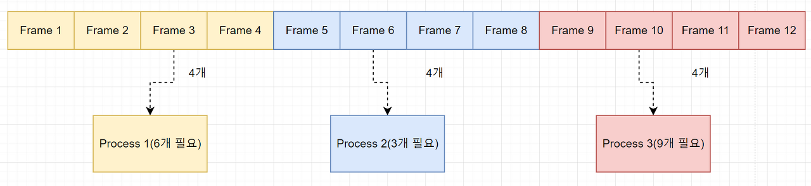
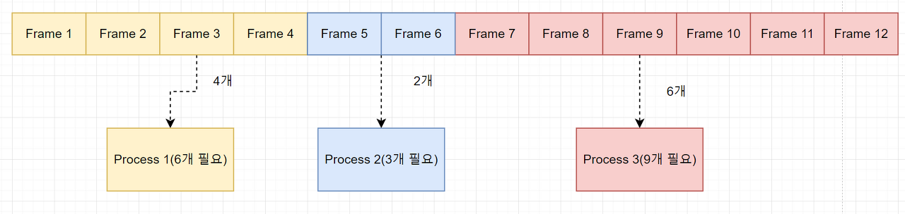

## 1. Thrashing이란 무엇인가?
- 프로세스가 실행되는 시간보다 페이지교체에 더 많은 시간을 소요하여 성능(=cpu이용률)이 저해되는 문제

## 2. Thrashing 발생 시, 어떻게 완화할 수 있는가?
- 스레싱이 발생하는 원인은, 각 프로세스가 필요로 하는 최소한의 프레임 수를 보장해주지 않았기 때문이다.
- 쓸데없이 많은 프레임이 할당되면, 메모리 효율측면에서 낮은 성능을 보이게 된다. 
- 따라서, 적절히 나누어주는 정책이 필요한데, 정적할당과 동적할당으로 구분할 수 있다.

- 정적할당
  - 균등할당방식
  
  

    - 프로세스의 크기와 상관없이 사용가능한 프레임을 모든 프로세스에게 동일하게 할당한다.
    - 단점 : 위 그림처럼, page fault를 일으키는 상황이 올 수 있다. 
  - 비례할당방식

    

    - 프로세스의 크기에 비례하여 프레임을 할당하는 방식이다.
    - 단점 : 프로세스의 크기에 비례해 메모리가 필요한 것은 아니다. 크기가 작은 프로세스임에도, 막상 실행해보니 많은 프레임을 필요로 한다면 비레할당이 적합하지 못할것이다.
- 동적할당
  - 작업집합모델 (working set model)
    - 가장 최근에 접근한 프레임이 이후에도 또 참조될 가능성이 높다라는 가정에서 출발한다.
    - 최근 일정시간동안 참조된 페이지들을 집합으로 만들고, 이 집합에 있는 페이지들을 물리 메모리에 유지하여 프로세스의 실행을 돕는다.
    - 단점 : 어떤 프레임을 물리메모리에 유지해야하는지는 알 수 있지만, 프로세스에 프레임을 얼마동안 할당해야하는지는 알 수 없기 때문에 스레싱을 해결하지 못한다. 
  - 페이지 부재 빈도 (page fault frequency)
    - page fault횟수를 기록하여 page fault frequency를 계산하는 방식이다.
    - page fault율의 상한선과 하한선을 정하고, 그 내부 범위 안에서만 프레임을 할당하는 방식이다.

- 참조블로그
  - https://qkrtngus116.tistory.com/61
  - https://kariskan.tistory.com/206
