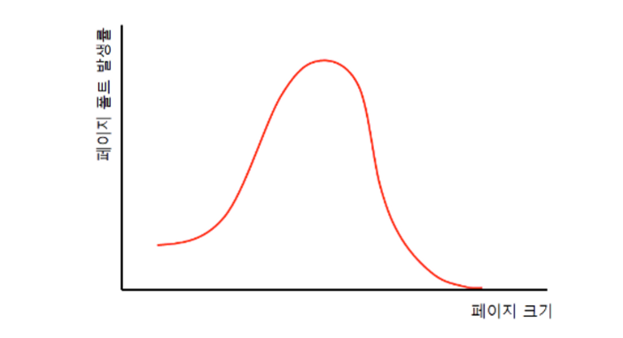

### 가상 메모리란 무엇인가요?

가상 메모리는 프로세스 전체가 아닌 일부만 메모리 영역으로 올리고, 나머지는 보조 기억장치인 디스크에 옮겨  
실제 메모리영역보다 더 큰 영역을 사용하는 것 처럼 보이게 하는 방식입니다.  
가상 메모리를 구현하는 방식으로 요구 페이징이 있습니다.

### 가상 메모리가 가능한 이유가 무엇일까요?

프로세스를 페이지 단위로 분할하여 메모리에 올리는 기법을 사용했기 떄문입니다.  
페이지 테이블을 사용하여, 페이지를 모두 메모리에 로드하지 않고 필요한 영역만 물리 메모리에 로드하고,  
필요하지 않은 페이지들은 디스크에 저장하기에 가능합니다.  

### Page Fault가 발생했을 때, 어떻게 처리하는지 설명해 주세요.

1. CPU는 기존의 작업 내용을 백업합니다.
2. 페이지 폴트 처리 루틴을 실행합니다.
3. 페이지 처리 루틴은 원하는 페이지를 메모리로 가져온 뒤 유효 비트를 1로 변경해 줍니다.
4. 페이지 폴트를 처리했다면 이제 CPU는 해당 페이지에 접근할 수 있게 됩니다.

### 페이지 크기에 대한 Trade-Off를 설명해 주세요.

페이지 크기가 작다면?  
페이지가 가지고 있는 정보가 적고, 작업이 한번에 요청하는 데이터보다 적을 가능성이 크기 때문에 page fault가 발생할 가능성이 줄어들게 됩니다. 
하지만, 많은 수의 페이지를 관리해야 되는 오버헤드가 이런 장점을 퇴색시킬 수 있습니다.  
  
페이지 크기가 크다면?  
작업이 한번에 요청하는 데이터가 작더라도, 포함한 페이지 전체가 로드되기 때문에 page fault가 발생할 가능성이 일반적으로 커지긴 합니다.  
하지만 상황에 따라 달라질 수 있는데, 만약 작업이 반복적이고 균일한 데이터 접근 패턴을 가지고 있다면 큰 페이지를 한번에 가져오는 전략이 이득일 수 있습니다. 
이렇게 되면 오히려 필요한 정보를 가지고 오기 위해서 페이지를 여러번 교체하고 가져오는 page fault 를 줄일 수 있습니다.  

### 페이지 크기가 커지면, 페이지 폴트가 더 많이 발생한다고 할 수 있나요?

위 그래프와 비슷한 양상을 보인다고 합니다.

페이지 크기가 커질수록, 물리 메모리에 들어갈 수 있는 페이지의 개수가 작아지기 때문에 페이지 교체 빈도수가 더 많이 발생합니다.
그러나, 특정 크기 구간 이후로는 Page Fault가 줄어듭니다.
페이지의 크기가 매우 커서 대부분의 경우에, 하나의 페이지 안에 필요한 다음 페이지가 들어있기 때문입니다.

[출처] https://hojunking.tistory.com/110

### 가상메모리는 페이징으로 메모리를 관리하는데, 세그멘테이션은 어떻게 할 수 있을까요?

일정한 단위가 아니라 논리적 단위로 쪼개는 세그멘테이션은 길이정보를 담는 limit과 시작주소를 담는 base를 가지고 있는 세그먼트 테이블로
메모리를 관리할 수 있습니다.  

---

### page fault란 무엇인가요?

페이지 폴트는 유효비트가 0인 공간에 접근하려고 했을 때 발생하는 인터럽트 입니다.  
유효비트란 : 현재 해당 페이지에 접근이 가능한지 알려주는 비트  
-> 해당 페이지가 스왑인,스왑아웃 상태인지 알려주는 비트. 
즉, 1이면 현재 메모리에 적재 되어 있다는 뜻. 0이면 현재 이 페이지는 메모리에 없고 스왑영역(보조기억장치)에 있다는 뜻  

### 페이지 교체 알고리즘 종류에 대해 말씀해주세요.

- FIFO : 선입선출
- 최적 페이지 교체 알고리즘 : 가장 오래 사용되지 않을 페이지 교체 -> 미래 예지라 이론상만 가능(다른 알고리즘의 하한선 비교대상으로 쓰고있음)
- LRU(Least Recently Used) : 가장 오래 사용되지 않은 페이지 교체 -> 최근에 사용한게 아니라면 미래에도 안쓰지않을까?

