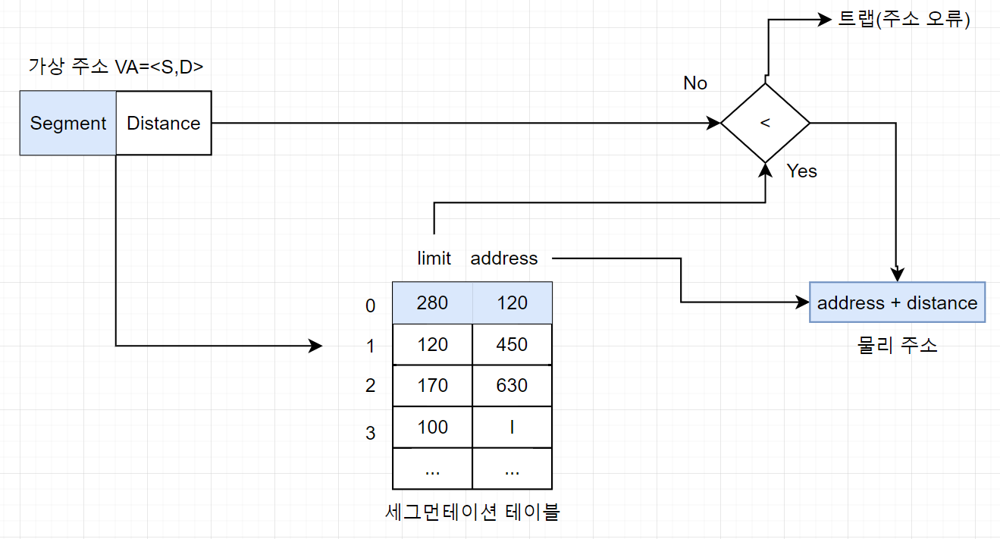

## 1. 가상 메모리란 무엇인가요?
- 실행하고자 하는 프로세스를 일부만 적재하여, 실제 물리메모리보다 더 큰 프로세스를 실행시킬 수 있는 기법을 의미한다.
- 가상 메모리에는 페이징과 세그멘테이션 기법이 있다.

## 2. 가상 메모리가 가능한 이유?
- 실행하고자 하는 프로세스 중 일부만 적재하기 때문에, 실제 물리메모리보다 더 큰 프로세스를 실행시킬 수 있다.

## 3. page fault가 발생했을때, 어떻게 처리하는가?
- page fault는 유효비트가 0(=실행하고자 하는 페이지가 메모리에 적재되지 않았다)일때, 발생하게 되는 인터럽트이다.
- page fault인터럽트는 다음과 같은 실행순서로 처리된다.
  - cpu는 기존 작업 내역을 백업한다.
  - page fault인터럽트 처리 루틴을 실행한다.
  - 메모리에 비어있는 프레임이 있다면, 원하는 페이지를 메모리에 가져온 후, 유효비트를 1로 설정한다.
    - page fault를 처리했다면, cpu는 해당 페이지를 접근하게 된다.
  - 메모리에 비어있는 프레임이 없다면, 희생 프레임을 골라 swap out한후, 메모리에 적재한다.

## 4. 페이지 크기에 대한 trade-off를 설명해주세요.
- 페이지 크기가 작다면, 
  - 장점 ) 프로세스가 사용하는 메모리의 양이 더욱 정확해짐 -> 프로세스의 성능 향상, 내부 단편화 감소
  - 단점 ) 페이지 테이블 크기가 증가 -> 메모리 사용량 증가
- 페이지 크기가 크다면,
  - 장점 ) 페이지 테이블 크기 감소 ->  메모리 사용량 감소
  - 단점 ) 프로세스가 사용하는 메모리의 양이 불확실해짐 -> 프로세스의 성능 감소, 내부 단편화 증가

- 참조 블로그
  - https://kariskan.tistory.com/206

## 5. 페이지 크기가 커지면, page-fault가 더 많이 발생한다고 할 수 있는가?, 일반적으로 페이지 사이즈는 4KB! 

- **페이지 크기가 커지면, 적재할 수 있는 페이지가 적어지기때문에** 참조 지역성 효과가 줄어든다. 따라서 **page-fault율은 증가**하게 된다.
- **페이지가 어느정도 커지게 되면, 실제 런타임에 필요한 프로세스 내용이 적재된 것이기 때문에 page-fault율은 감소**하게 된다.

- 참조 블로그
  - https://kariskan.tistory.com/206

## 6. 가상메모리는 페이징으로 메모리를 관리하는데, segmentation은 어떻게 할 수 있을까요?

- segmentation은 프로세스의 주소공간을 의미 단위의 세그먼트로 나누어 물리적 메모리로 올리는 기법을 의미한다.
- 프로세스 주소공간은 일반적으로 code, data, stack등 의미 있는 단위들로 구성된다.
- **일반적으로 code, data, stack, main program등 연관된 기능 단위로 segment를 정의**하며 논리적 단위로 나눈것이기 때문에 **segement크기가 균일하지 않을 수 있다.**
- **segment는 크기가 균일하지 않기때문에 외부단편화가 발생한다는 단점이 있다.**

- segmentation기법에서는 세그먼트 테이블을 사용한다.
- 세그먼트 테이블에는 두가지 정보를 가지고 있다.
  - 기준점(address)
    - 물리적 메모리에서 **세그먼트의 시작위치**
  - 한계점(limit)
    - **세그먼트의 길이**

- 세그먼트 테이블 주소 변환
  
  

  - 세그멘테이션 기법에서는 가상 주소를 VA=<S,D>로 표현한다.
    - S = 세그먼트 번호
    - D = 세그먼트 시작지점에서 해당 주소까지의 거리
  
  - 위 그림에서, 프로세스 A는 세그먼트 0, 프로세스 B는 세그먼트 1, 프로세스 C는 세그먼트 2로 분할되었다고 하자.
  - 프로세스 A의 32번지에 접근할때 주소 변환 과정은 아래와 같다.
    - VA = <0, 32> 이므로, 세그먼트 0의 시작주소를 알아낸 후(=120), 시작주소 120에 거리 32를 더하여 물리주소152번지를 구한다.
    - 이때, 메모리 관리자는 **세그먼트의 크기보다 큰 지 검사한다.**
      - 만약 크다면, 메모리를 벗어나는 것이므로, 메모리 오류를 출력하고 해당 프로세스를 강제 종료한다. 
        - 이떄, 발생하는 오류를 **trap**이라고 한다.
        - trap은 자신의 영역을 벗어나는 주소에 접근하거나 숫자를 0으로 나누는 것과 같이 **사용자가 의도치 않게 일으키는 인터럽트**를 말한다.
        - trap이 발생하면 운영체제는 사용자에게 segementation fault 메시지를 보낸다.

        > 트랩과 반대로 사용자가 강제로 `ctrl + c`키를 눌러 프로세스를 중지시키는 것과 같이 사용자가 의도한 인터럽트를 시그널(signal)이라고 한다. 시그널은 외부 인터럽트 중 하나이다.
 
      - 그렇지 않다면 물리 주소를 구한다.
    - 물리 주소 152번지에 접근하여 원하는 데이터를 읽거나 쓴다.

- 참조블로그
  - https://velog.io/@chappi/OS%EB%8A%94-%ED%95%A0%EA%BB%80%EB%8D%B0-%ED%95%B5%EC%8B%AC%EB%A7%8C-%ED%95%A9%EB%8B%88%EB%8B%A4.-15%ED%8E%B8-%EA%B0%80%EC%83%81-%EB%A9%94%EB%AA%A8%EB%A6%AC-%EC%84%B8%EA%B7%B8%EB%A8%BC%ED%85%8C%EC%9D%B4%EC%85%98-%EC%84%B8%EA%B7%B8%EB%A8%BC%ED%85%8C%EC%9D%B4%EC%85%98-%ED%8E%98%EC%9D%B4%EC%A7%95-%ED%98%BC%EC%9A%A9-%EA%B8%B0%EB%B2%95
