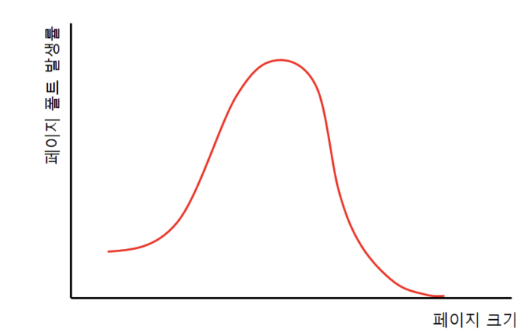

## 1. 가상 메모리란 무엇인가요?
- 실행하고자 하는 프로세스를 일부만 적재하여, 실제 물리메모리보다 더 큰 프로세스를 실행시킬 수 있는 기법을 의미한다.
- 가상 메모리에는 페이징과 세그멘테이션 기법이 있다.

## 2. 가상 메모리가 가능한 이유?
- 실행하고자 하는 프로세스 중 일부만 적재하기 때문에, 실제 물리메모리보다 더 큰 프로세스를 실행시킬 수 있다.

## 3. page fault가 발생했을때, 어떻게 처리하는가?
- page fault는 유효비트가 0(=실행하고자 하는 페이지가 메모리에 적재되지 않았다)일때, 발생하게 되는 인터럽트이다.
- page fault인터럽트는 다음과 같은 실행순서로 처리된다.
  - cpu는 기존 작업 내역을 백업한다.
  - page fault인터럽트 처리 루틴을 실행한다.
  - 메모리에 비어있는 프레임이 있다면, 원하는 페이지를 메모리에 가져온 후, 유효비트를 1로 설정한다.
    - page fault를 처리했다면, cpu는 해당 페이지를 접근하게 된다.
  - 메모리에 비어있는 프레임이 없다면, 희생 프레임을 골라 swap out한후, 메모리에 적재한다.

## 4. 페이지 크기에 대한 trade-off를 설명해주세요.
- 페이지 크기가 작다면, 
  - 장점 ) 프로세스가 사용하는 메모리의 양이 더욱 정확해짐 -> 프로세스의 성능 향상, 내부 단편화 감소
  - 단점 ) 페이지 테이블 크기가 증가 -> 메모리 사용량 증가
- 페이지 크기가 크다면,
  - 장점 ) 페이지 테이블 크기 감소 ->  메모리 사용량 감소
  - 단점 ) 프로세스가 사용하는 메모리의 양이 불확실해짐 -> 프로세스의 성능 감소, 내부 단편화 증가

- 참조 블로그
  - https://kariskan.tistory.com/206

## 5. 페이지 크기가 커지면, page-fault가 더 많이 발생한다고 할 수 있는가?

- **페이지 크기가 커지면, 적재할 수 있는 페이지가 적어지기때문에** 참조 지역성 효과가 줄어든다. 따라서 **page-fault율은 증가**하게 된다.
- **페이지가 어느정도 커지게 되면, 실제 런타임에 필요한 프로세스 내용이 적재된 것이기 때문에 page-fault율은 감소**하게 된다.

- 참조 블로그
  - https://kariskan.tistory.com/206

## 6. segmentation 방식을 사용하고 있다면, 가상 메모리를 사용할 수 없을까요?
